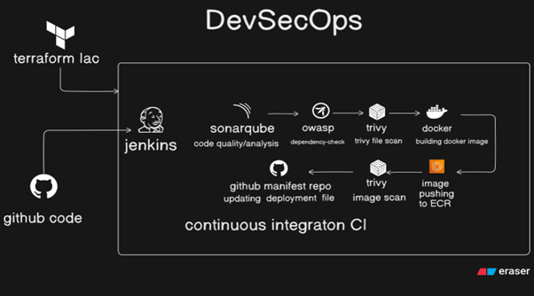

# MERN Stack To-Do App — Jenkins CI Pipeline

## Overview

This repository contains the **CI pipeline** for a MERN stack To-Do application. It uses Jenkins to automate code quality checks, security scans, Docker image builds, and GitOps manifest updates on every push.



### CI Pipeline Stages

| Stage | Tool | Purpose |
|---|---|---|
| Source Code Analysis | SonarQube | Code quality & vulnerability detection |
| Quality Gate | SonarQube | Blocks pipeline if quality standards not met |
| Dependency Scan | OWASP Dependency-Check | Detects vulnerable third-party libraries |
| Filesystem Scan | Trivy | Scans source code for secrets & misconfigs |
| Build | Docker | Builds frontend & backend images |
| Compose Validation | Docker Compose | Validates multi-container stack runs correctly |
| Push | Docker Hub | Publishes versioned images |
| Image Scan | Trivy | Scans built images for CVEs |
| GitOps Update | yq + Git | Updates K8s manifests with new image tags |

---

## Pre-requisites

> All steps are for **Ubuntu 22.04** on an EC2 instance.

### 1. System Update

```bash
sudo apt update -y && sudo apt upgrade -y
```

### 2. Java

```bash
sudo apt install -y fontconfig openjdk-21-jre
java -version
```

### 3. Git

```bash
sudo apt install -y git
git --version
```

### 4. Jenkins

```bash
sudo wget -O /etc/apt/keyrings/jenkins-keyring.asc \
  https://pkg.jenkins.io/debian-stable/jenkins.io-2026.key

echo "deb [signed-by=/etc/apt/keyrings/jenkins-keyring.asc]" \
  https://pkg.jenkins.io/debian-stable binary/ | sudo tee \
  /etc/apt/sources.list.d/jenkins.list > /dev/null

sudo apt update
sudo apt install -y jenkins
sudo systemctl enable jenkins
sudo systemctl start jenkins

# Get initial admin password
sudo cat /var/lib/jenkins/secrets/initialAdminPassword
```

### 5. Docker

```bash
sudo apt install -y ca-certificates curl
sudo install -m 0755 -d /etc/apt/keyrings
sudo curl -fsSL https://download.docker.com/linux/ubuntu/gpg -o /etc/apt/keyrings/docker.asc

echo "deb [arch=$(dpkg --print-architecture) signed-by=/etc/apt/keyrings/docker.asc] \
  https://download.docker.com/linux/ubuntu $(. /etc/os-release && echo "$VERSION_CODENAME") stable" \
  | sudo tee /etc/apt/sources.list.d/docker.list > /dev/null

sudo apt update && sudo apt install -y docker-ce docker-ce-cli containerd.io
sudo systemctl start docker
sudo systemctl enable docker

# Allow Jenkins to run Docker commands
sudo usermod -aG docker ubuntu && newgrp docker
sudo usermod -aG docker jenkins && newgrp docker
sudo systemctl restart jenkins
```

### 6. Trivy

```bash
wget -qO - https://aquasecurity.github.io/trivy-repo/deb/public.key | \
  gpg --dearmor | sudo tee /etc/apt/keyrings/trivy.gpg > /dev/null

echo "deb [signed-by=/etc/apt/keyrings/trivy.gpg] https://aquasecurity.github.io/trivy-repo/deb generic main" | \
  sudo tee /etc/apt/sources.list.d/trivy.list > /dev/null

sudo apt-get update && sudo apt-get install -y trivy
trivy --version
```

### 7. yq (YAML processor)

```bash
sudo wget https://github.com/mikefarah/yq/releases/latest/download/yq_linux_amd64 -O /usr/bin/yq
sudo chmod +x /usr/bin/yq
yq --version
```

### 8. OWASP Dependency-Check

```bash
cd /opt
sudo wget https://github.com/jeremylong/DependencyCheck/releases/download/v10.0.4/dependency-check-10.0.4-release.zip
sudo unzip dependency-check-10.0.4-release.zip
sudo chmod +x /opt/dependency-check/bin/dependency-check.sh
```

### 9. SonarQube (Docker)

```bash
docker run -d \
  --name sonarqube \
  --restart always \
  -p 9000:9000 \
  sonarqube:lts-community
```

> Access SonarQube at `http://<EC2-IP>:9000` — default credentials are `admin / admin`

---

## Jenkins Setup

### 1. Access Jenkins

- Open `http://<EC2-IP>:8080` in your browser
- Enter the initial admin password:
```bash
sudo cat /var/lib/jenkins/secrets/initialAdminPassword
```
- Click **Install suggested plugins**
- Create your admin user

### 2. Install Required Plugins

Go to **Jenkins → Manage Jenkins → Plugins → Available plugins** and install:

| Plugin | Purpose |
|---|---|
| GitHub Integration | Webhook trigger on push |
| SonarQube Scanner | SonarQube analysis |
| NodeJS | Node.js tool installation |
| Docker | Docker build & push |
| Docker Compose Build Step | Docker Compose support |
| OWASP Dependency-Check | Dependency scan reports |
| Blue Ocean *(optional)* | Better pipeline visualization |

### 3. Configure Tools

Go to **Jenkins → Manage Jenkins → Tools**:
- Under **SonarQube Scanner** → Add → name: `sonar-scanner`
- Under **NodeJS** → Add → name: `NodeJS-18`, version: `18.x`
- Under **Git** → verify Git installation path

### 4. Configure Credentials

Go to **Jenkins → Manage Jenkins → Credentials → System → Global credentials → Add Credentials**:

| ID | Kind | Description |
|---|---|---|
| `dockerhub-credentials` | Username with password | Docker Hub username & password/token |
| `github-credentials` | Username with password | GitHub username & personal access token |
| `sonarqube-token` | Secret text | SonarQube authentication token |

### 5. Configure GitHub Webhook

In your GitHub repository go to **Settings → Webhooks → Add webhook**:
- Payload URL: `http://<EC2-IP>:8080/github-webhook/`
- Content type: `application/json`
- Trigger: **Just the push event**

### 6. Create Pipeline Job

- Go to **Jenkins → New Item**
- Select **Pipeline** and give it a name
- Under **Build Triggers** → check **GitHub hook trigger for GITScm polling**
- Under **Pipeline** → select **Pipeline script from SCM**
  - SCM: `Git`
  - Repository URL: your GitHub repo URL
  - Credentials: `github-credentials`
  - Branch: `*/main`
  - Script Path: `Jenkinsfile`
- Click **Save**

---

## SonarQube Setup

### 1. Access SonarQube

- Open `http://<EC2-IP>:9000` in your browser
- Login with default credentials: `admin / admin`
- Set a new password when prompted

### 2. Generate Authentication Token

- Go to **My Account → Security → Generate Tokens**
- Name: `jenkins-token`, Type: `Global Analysis Token`
- Click **Generate** and copy the token
- Add this token in Jenkins credentials as `sonarqube-token` (Secret text)

### 3. Configure SonarQube in Jenkins

Go to **Jenkins → Manage Jenkins → System**:
- Scroll to **SonarQube installations** → Add SonarQube:
  - Name: `sonarqube-server`
  - Server URL: `http://<EC2-IP>:9000`
  - Server authentication token: select `sonarqube-token`
- Click **Save**

### 4. Create Projects in SonarQube

- Go to **Projects → Create Project → Manually**
- Create two projects:
  - Project key: `mern-frontend`, Display name: `MERN Frontend`
  - Project key: `mern-backend`, Display name: `MERN Backend`

---

## Jenkins Configuration

### Required Plugins

| Plugin | Purpose |
|---|---|
| GitHub Integration | Webhook trigger on push |
| SonarQube Scanner | SonarQube analysis |
| NodeJS | Node.js tool installation |
| Docker | Docker build & push |
| Docker Compose Build Step | Docker Compose support |
| OWASP Dependency-Check | Dependency scan reports |
| Blue Ocean *(optional)* | Better pipeline visualization |

### Manage Tools

Go to **Jenkins → Manage Jenkins → Tools**:
- Add **SonarQube Scanner** — name: `sonar-scanner`
- Add **NodeJS** — name: `NodeJS-18`
- Add **Git** installation

### Manage System

Go to **Jenkins → Manage Jenkins → System**:
- Under **SonarQube installations**:
  - Name: `sonarqube-server`
  - URL: `http://<EC2-IP>:9000`
  - Add SonarQube authentication token as a credential

### Credentials

Go to **Jenkins → Manage Jenkins → Credentials** and add:

| ID | Type | Description |
|---|---|---|
| `dockerhub-credentials` | Username with password | Docker Hub username & password/token |
| `github-credentials` | Username with password | GitHub username & personal access token |
| `sonarqube-token` | Secret text | SonarQube authentication token |

---

## Cleanup

### Remove SonarQube Container

```bash
docker stop sonarqube && docker rm sonarqube
```

### Full EC2 Cleanup

```bash
sudo systemctl stop jenkins docker 2>/dev/null

sudo apt-get remove --purge -y jenkins
sudo rm -f /etc/apt/sources.list.d/jenkins.list /etc/apt/keyrings/jenkins-keyring.asc

sudo apt-get remove --purge -y docker-ce docker-ce-cli containerd.io
sudo rm -f /etc/apt/sources.list.d/docker.list /etc/apt/keyrings/docker.asc

sudo apt-get remove --purge -y trivy
sudo rm -f /etc/apt/sources.list.d/trivy.list /etc/apt/keyrings/trivy.gpg

sudo apt-get remove --purge -y openjdk-21-jre openjdk-21-jre-headless
sudo rm -f /usr/bin/yq
sudo rm -rf /opt/dependency-check

sudo apt-get autoremove -y && sudo apt-get clean
```
